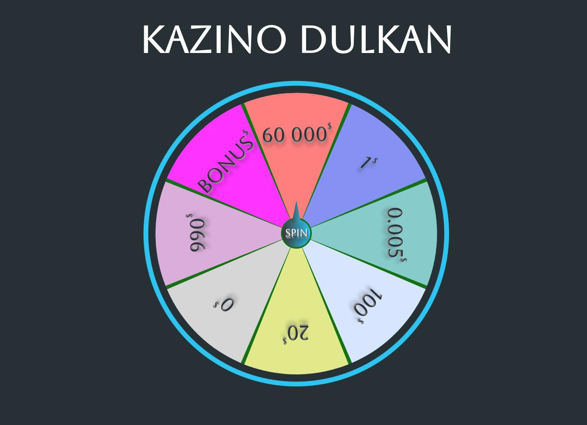

## Kazino



#Команды

| Действие               | Команда         |
| ---------------------- | :-------------- |
| Установить зависимости | `npm i`         |
| Запустить dev-сервер   | `npm run serve` |
| Собрать в production   | `npm run build` |

<div align="left">

## Проект сожержит

<details>
  <summary>SCSS</summary>
 
  [Что это?](https://sass-scss.ru/)

  </details>

<details>
  <summary>Семантическую вёрстку</summary>
 
  [Что это?](https://htmlacademy.ru/blog/articles/semantics)

     Подход к разметке, который опирается не на содержание сайта, а на смысловое предназначение каждого блока и логическую структуру документа. Даже в этой статье есть заголовки разных уровней — это помогает читателю выстроить в голове структуру документа. Так и на странице сайта — только читатели будут немного другими.

</details>
<details>
  <summary>Webpack</summary>
 
    По умолчанию [localhost:8080](http://localhost:8080).
</details>

#

## Связвться со мной

<div align='center'> 
 
 ```
vladislavbobyrev@yandex.ru
```
 
 [](https://t.me/VladislavBobyrev)

 </div>
 
<div align="center">
  <h2>**ВНИМАНИЕ!**  Вся конфигурация является открытой. </h2>
 
</div>
